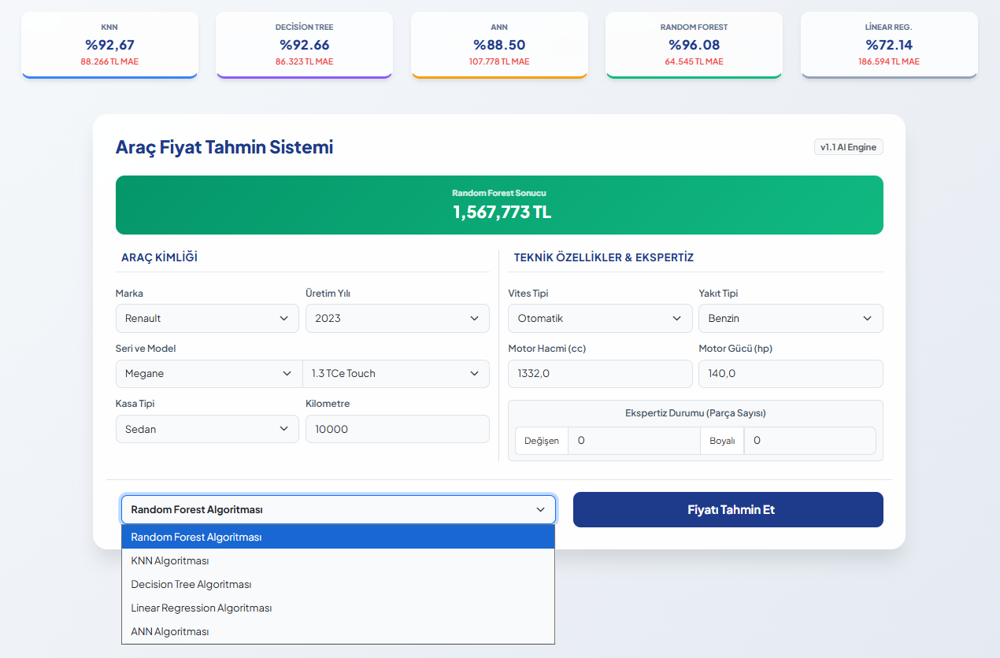

# İkinci El Araç Fiyat Tahmin Sistemi

Bu proje, Türkiye ikinci el otomobil piyasasını analiz ederek araçların fiyatını tahmin eden ve segmentlere ayıran bir **Makine Öğrenmesi** ve **Derin Öğrenme** sistemidir.

## 📊 Model Performans Metrikleri
Projenin final raporunda belirtilen algoritma başarı oranları:

| Algoritma | Test R² Skoru | Test MAE (Hata) | Accuracy (Sınıflandırma) |
| :--- | :---: | :---: | :---: |
| **Random Forest** | **%96.08** | **64,545.28 TL** | **%85.80** |
| Decision Tree | %92.66 | 86,323.56 TL | %81.92 |
| KNN | %92.67 | 88,266.44 TL | %80.22 |
| ANN (Yapay Sinir Ağları) | %88.50 | 107,778.83 TL | %84.60 |
| Linear & Logistic | %72.14 | 186,594.04 TL | %79.02 |

> [cite_start]**Analiz Sonucu:** En yüksek tahmin başarısı Random Forest modelinde elde edilmiştir[cite: 315].

## 🛠️ Model Eğitimi ve Süreç
Tüm eğitim süreçleri `notebooks/` dizini altındaki dosyalarda detaylandırılmıştır:
### 🛠️ Veri Ön İşleme ve Mühendislik (Data Engineering)
Ham veri setinin makine öğrenmesi algoritmaları tarafından yüksek doğrulukla işlenebilmesi için şu teknik süreçler uygulanmıştır:

* [cite_start]**Regex ile Ekspertiz Analizi:** Karmaşık metin yapısına sahip olan "boya_degisen" sütunu düzenli ifadeler (Regex) kullanılarak ayrıştırılmış; her araç için `degisen_sayisi` ve `boyali_sayisi` adında iki yeni sayısal öznitelik üretilmiştir[cite: 51, 52].
* [cite_start]**Birim ve Metin Temizliği:** "TL" ve "km" gibi metinsel ifadeler ile noktalama işaretleri kaldırılarak tüm sütunlar sayısal (float/int) formata dönüştürülmüştür[cite: 50].
* [cite_start]**Motor Özelliklerinin Standardizasyonu:** "1.299 cc" veya "130-150 hp" gibi aralık veya birim içeren veriler işlenerek, bu değerlerin sayısal ortalamasını alan yeni sütunlar oluşturulmuştur[cite: 53].
* **İstatistiksel Filtreleme (Outlier):** Modelin başarısını bozan aykırı verileri temizlemek adına; [cite_start]100.000 TL altı, 40.000.000 TL üstü fiyatlar ve 0-700.000 km aralığı dışındaki kayıtlar kapsam dışı bırakılmıştır[cite: 48].
* [cite_start]**Hibrit Encoding Yaklaşımı:** Marka, Seri ve Model gibi hiyerarşik veriler için **Label Encoding**[cite: 56]; [cite_start]Vites, Yakıt ve Kasa tipi gibi kategoriler için ise **One-Hot Encoding** yöntemi uygulanmıştır[cite: 57].
* [cite_start]**Kritik Veri Yönetimi:** Model başarısı için temel teşkil eden vites tipi, kasa tipi, motor hacmi ve gücü sütunlarında boş (NaN) değer içeren satırlar veri bütünlüğü için silinmiştir[cite: 47].
- [cite_start]**random_forest.ipynb:** %96.08 başarıya ulaşan ana regresyon modelinin eğitimi[cite: 89].
- [cite_start]**ann.ipynb:** 128, 64 ve 32 nöronlu katmanlardan oluşan derin öğrenme mimarisi[cite: 82].
- [cite_start]**knn.ipynb, decision_tree.ipynb:** Algoritma karşılaştırma ve test süreçleri[cite: 72, 69].

## 🖥️ Arayüz Görünümü

## 📂 Proje Yapısı
- `main.py`: Flask web sunucusu kodları.
- `notebooks/`: Model eğitimine ait Jupyter Notebook dosyaları.
- `templates/ & static/`: Web arayüzü dosyaları.
- [cite_start]`arac_fiyat`: Projenin veritabanı dosyası[cite: 390].

